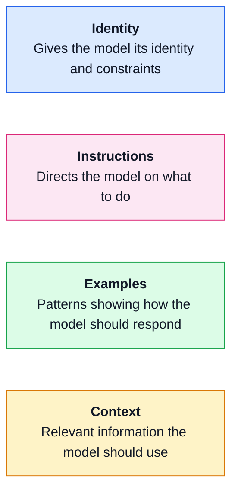
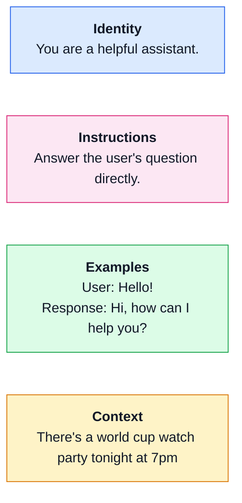
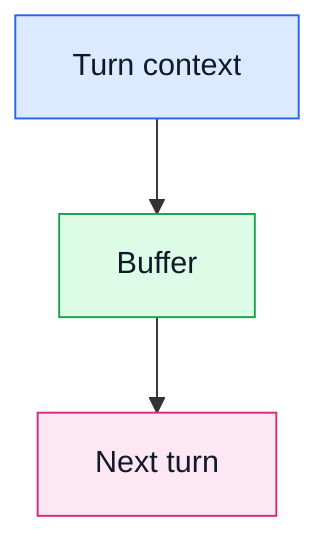
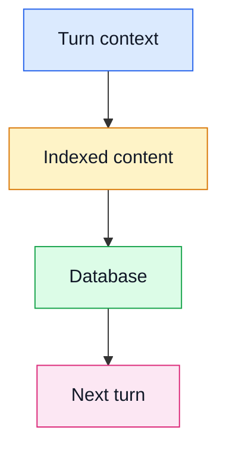

# Building Deep Research Agents 

Ben Batorsky + Eric Ma

repo: https://github.com/ericmjl/build-deep-research-agent

Follow setup instructions, run `pixi run nb0` for initial setup

<div class="abs-br m-6 text-sm opacity-60">
SciPy 2026
</div>

<!--
Speaker notes for the title slide.
-->

---
layout: two-cols-header
layoutClass: gap-2
class: text-sm leading-tight
---
# About us

::left::
<div class="h-full min-h-0 flex flex-col gap-2">


<div class="text-[0.9em] leading-tight">

- PhD, Policy Analysis/Economics, RAND Corporation
- Decade in Data Science, focus on NLP
- US Responsible AI Lead, Philips

</div>
</div>

::right::

<div class="h-full min-h-0 flex flex-col gap-2">

</div>

- ScD, Biological Engineering, MIT
- https://ericmjl.github.io/blog/ 
- Trainer, researcher, nice guy
- Senior Principal Data Scientist, Moderna

---
layout: image-right-caption
image: /images/levels-of-autonomy.png
backgroundSize: contain
---

# What is an Agent?

- Anthropic: Systems where LLMs dynamically direct their own processes and tool usage, maintaining control over how they accomplish tasks.
- Workflow - set of steps with LLM involved
  - Limited number of “paths”
- Agent - LLM decides the steps
  - More variety in paths

::caption::

Adapted from [What is an AI agent? - LangChain Blog](https://blog.langchain.dev/what-is-an-agent/)

---

<div class="h-full flex flex-col min-h-0">

# Components of an agent


<div class="w-full text-left text-xs leading-snug opacity-85 pt-2 shrink-0">

<a href="https://developer.nvidia.com/blog/introduction-to-llm-agents/" target="_blank">Introduction to LLM Agents - NVIDIA Technical Blog</a>

</div>

</div>

---
layout: two-cols-header
layoutClass: gap-4
class: h-full min-h-0
---

# Deep Research Agents

::left::

<div class="flex-1 min-h-0 flex items-center justify-center px-2">

</div>

::right::

<div class="flex-1 min-h-0 flex items-center justify-center px-2">

</div>

---
layout: two-cols
layoutClass: gap-4
class: h-full min-h-0 overflow-hidden flex flex-col
---

::left::

### What you see with ChatGPT

<div class="flex-1 min-h-0 flex items-center justify-center px-2">

</div>

::right::

### What's going on behind the scenes

<div class="flex-1 min-h-0 overflow-auto">
<div class="min-h-full min-w-full w-max flex items-center justify-center p-2">

</div>
</div>

<div class="w-full text-left text-xs leading-snug opacity-85 shrink-0 pt-2">

<a href="https://developers.openai.com/cookbook/examples/deep_research_api/introduction_to_deep_research_api_agents" target="_blank">Introduction to Deep Research API Agents — OpenAI Cookbook</a>

</div>

---
layout: quote-slide
---

# Hands on - Pick your favorite

> Ask for research on "pitch"

---

<div class="h-full flex flex-col min-h-0">

# What do we notice?


</div>

---
layout: image-right-caption
image: /images/in-context-learning.png
backgroundSize: contain
---

# In-context learning

- Large Language Models typically decoder-based
  - Autoregressive; next state subject to previous states
  - ANY change to the previous state has cascading effects
- Output can be "steered" by the prompt, no "learning" necessary
- Tools, memory, other functions are typically components of the input prompt

---
layout: two-cols-header
layoutClass: gap-2
class: text-sm leading-tight
---
# Details in context

::left::

### Example basic prompt 
(Ollama->Llama3.2)

<|start_header_id|>system<|end_header_id|>
You are a helpful assistant.

<|start_header_id|>user<|end_header_id|>
Hi!<|eot_id|>

<|start_header_id|>assistant<|end_header_id|>

::right::

### Example prompt with tools

<|start_header_id|>system<|end_header_id|>

When you receive a tool call response, use the output to format an answer to the orginal user question.

You are a helpful assistant with tool calling capabilities.

<|eot_id|><|start_header_id|>user<|end_header_id|>

Given the following functions, please respond with a JSON for a function call with its proper arguments that best answers the given prompt.

Respond in the format {"name": function name, "parameters": dictionary of argument name and its value}. Do not use variables.

{"type":"function","function":{"name":"today","description":"Returns today's date, use this when you need to get today's date.    The input should always be an empty string.","parameters":{"type":"object","required":["text"],"properties":{"text":{"type":"string"}}}}}

Question: What day is it today?<|eot_id|>

---
layout: two-cols-header
layoutClass: gap-2
class: text-sm leading-tight prompt-cols-center
---
# Prompt Anatomy

::left::

<div class="flex-1 flex items-center justify-center w-full min-h-0">



</div>

::right::

<div class="flex-1 flex items-center justify-center w-full min-h-0">



</div>

---

## Hands-on: Prompt engineering

---
layout: two-cols
---

# Memory in LLMs

::left::

<div class="memory-table">

| &nbsp; | &nbsp; | &nbsp; |
|---|--|--|
| What is being written? | &nbsp; | &nbsp; |
| How is it written? | &nbsp; | &nbsp; |
| How is it retrieved? | &nbsp; | &nbsp; |

</div>

::right::

<div class="flex items-start justify-center gap-6 w-full">

<div class="flex flex-col items-center">

**Simple**



</div>

<div class="flex flex-col items-center">

**Complex**



</div>

</div>

---
layout: two-cols
---

# Append-only memory

::left::

<div class="memory-table">

| &nbsp; | **Append-only** | &nbsp; |
|---|-----------------|--|
| What is being written? | Request, response | &nbsp; |
| How is it written? | Append to list | &nbsp; |
| How is it retrieved? | Entire list injected into prompt context | &nbsp; |

</div>

::right::

### Memory grows every turn

```python
history = ()

# Turn 1
request_1 = prompt + history
response_1 = model(request_1)
history = (*history, request_1, response_1)
# (request_1, response_1)

# Turn 2
request_2 = prompt + history
response_2 = model(request_2)
history = (*history, request_2, response_2)
# (request_1, response_1, request_2, response_2)

# Turn 3
request_3 = prompt + history
response_3 = model(request_3)
history = (*history, request_3, response_3)
# (request_1, response_1, request_2, response_2,
#  request_3, response_3)
```

---
layout: two-cols
---

# Entity-based memory

::left::

<div class="memory-table">

| &nbsp; | **Append-only** | **Entity-based** |
|---|-----------------|------------------|
| What is being written? | Request, response | Citation ID, summary |
| How is it written? | Append to list | Append to list |
| How is it retrieved? | Entire list injected into prompt context | Most recent summary for each ID injected into prompt context |

</div>

::right::

### Entries grow, retrieval dedupes

```python
entries = ()

# Turn 1: cite paper A
request_1 = prompt + entries
response_1 = model(request_1)
entries = (*entries, (paper_a, response_1))
# ((paper_a, response_1))

# Turn 2: cite paper B
request_2 = prompt + entries
response_2 = model(request_2)
entries = (*entries, (paper_b, response_2))
# ((paper_a, response_1), (paper_b, response_2))

# Turn 3: revisit paper A
request_3 = prompt + entries
response_3 = model(request_3)
entries = (*entries, (paper_a, response_3))
# ((paper_a, response_1), (paper_b, response_2),
#  (paper_a, response_3))

```

---

# Key risks with Research Agents

- Security - Could the agent be misused? 
- Reliability - Can I trust what the agent produces?
- Ethics - Is the output intellectually honest?

---
layout: image-right-caption
image: /images/shadowleak.png
backgroundSize: contain
---

# Security - Could the agent be misused?

- Data exfiltration - Unauthorized transfer of data 
  - 2025 - OpenAI Deep Research on Gmail manipulated to leak sensitive data
- Prompt injection - Manipulation of agent prompt for malicious purposes
- Unsafe actions - Without proper guardrails, agent can do extensive damage
  - OpenClaw - What happens if I give an agent control over my entire filesystem?

::caption::

[https://www.radware.com/blog/threat-intelligence/shadowleak/](https://www.radware.com/blog/threat-intelligence/shadowleak/)

---
layout: image-right-caption
image: /images/autoresearchbench.png
backgroundSize: contain
---

# Reliability - Can I trust what the agent produces?

- Hallucination - Making up citations, quotes and references
- Inconsistency - Each run produces different results
- Poor performance - Research agents have low scores against benchmarks

::caption::

Xiong, Lei, et al. "AutoResearchBench: Benchmarking AI Agents on Complex Scientific Literature Discovery." arXiv preprint arXiv:2604.25256 (2026).

---
layout: image-right-caption
image: /images/ai-top-sources-2025.png
backgroundSize: contain
---

# Ethics - Is the output intellectually honest?

- Dominant viewpoints - Historical biases in research and in text corpora
  - Reddit - 2/3rds male, >50% in US
  - Africa + South America + Oceania = 5% of citations
- Plagiarism - Are references properly cited?
  - CNET discontinuing use of AI for generating content
  - CNN lawsuit against Perplexity
- Transparency - How, exactly, does it work?

::caption::

Statista. "Where AI Gets Its Info: Top Sources 2025." Statista, 2025.

---

# Eric says - Do your evals!!

---

# What can we do?

| Risk | Mitigation | Sources |
|------|------------|---------|
| Security | Least privilege, sandboxing, verification | NIST AI profile, CISA+UK guidance |
| Reliability | pass ^ k, groundedness | HELM, tau-bench |
| Ethics | System cards, community involvement | Aequitas project, BBQ benchmark |
